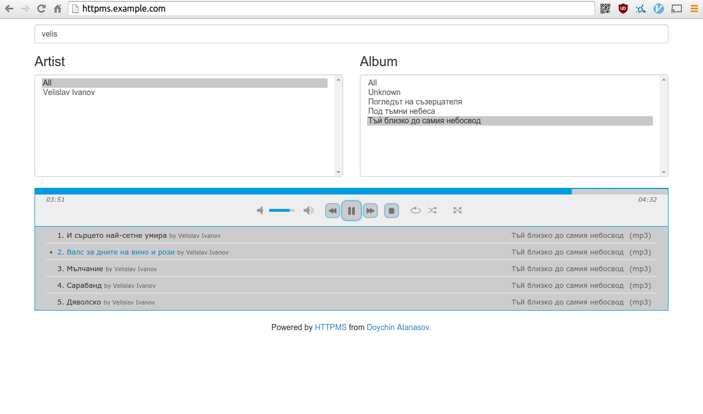

[](https://travis-ci.org/ironsmile/httpms)

HTTP Media Server
======

A way to listen to your music library from everywhere. Once set up you won't need anything but a browser.
HTTPMS will let you browse through and listen to your music over HTTP.
Up until now I've had a really bad time listening to my music which is stored back home.
I would create a mount over ftp, sshfs or something similar and point the local player to
the mounted library. Every time it resulted in some upleasantries. Just imagine searching
in a network mounted directory!

No more!

Web UI
======

Have a taste of how its web interface looks like



It comes with a custom [jPlayer](https://github.com/happyworm/jPlayer) which can handle playlists with thousands of songs.

I feel obliged to say that the music on the screenshot is written and performed by my close friend [Velislav Ivanov](http://www.progarchives.com/artist.asp?id=4264).

Requirements
======
If you want to install it from source (from here) you will need:

* [Go](http://golang.org/) 1.1.2 or later [installed and properly configured](http://golang.org/doc/install).

* [go-taglib](https://github.com/landr0id/go-taglib) - Read the [install notes](https://github.com/landr0id/go-taglib#install)

* [go-sqlite3](https://github.com/mattn/go-sqlite3) - `go get github.com/mattn/go-sqlite3`

For the moment I do not plan to distribute it any other way.


Install
======

1. Run ```go get github.com/ironsmile/httpms```

2. Start it with ```httpms```

3. [Edit the config.json](#configuration) and add your library paths to the "library" field


Docker
======

Alternatively to installing everything in your environment you can use my [docker image](https://github.com/ironsmile/docker-httpms).

```docker build -t ironsmile/httpms github.com/ironsmile/docker-httpms```

It is ready for running or development.


Features
======

* Uses [jplayer](https://github.com/happyworm/jPlayer) to play your music so it will probably work in every browser
* jplayer supports mp3, oga, wav, flac and m4a audio formats
* Interface and media via HTTPS
* HTTP Basic Authenticate
* Playlists
* Search by track name, artist or album
* Download whole album in a zip file with one click

Configuration
======

HTTPS configuration is saved in a json file, different for every user in the system. Its
location is as follows:

* Linux or BSD: ```$HOME/.httpms/config.json```
* Windows: ```%APPDATA%\httpms\config.json```

When started for the first time HTTPMS will create one for you. Here is an example:

```javascript
{
    // Address and port on which HTTPMS will listen. It is in the form hostname[:port]
    // For exact explanation see the Addr field in the Go's net.http.Server
    // Make sure the user running HTTPMS have permission to bind on the specified
    // port number
    "listen": ":443",

    // true if you want to access HTTPMS over HTTPS or false for plain HTTP.
    // If set to true the "ssl_certificate" field must be configured as well.
    "ssl": true,

    // Provides the paths to the certificate and key files. Must be full paths, not
    // relatives. If "ssl" is false this can be left out.
    "ssl_certificate": {
        "crt": "/full/path/to/certificate/file.crt",
        "key": "/full/path/to/key/file.key"
    },

    // true if you want the server to require HTTP basic authentication. Credentials
    // are set by the 'authentication' field below.
    "basic_authenticate": true,
    
    // User and password for the HTTP basic authentication.
    "authentication": {
        "user": "example",
        "password": "example"
    },

    // An array with all the directories which will be scanned for media. They must be
    // full paths and formatted according to your OS. So for example a Windows path
    // have to be something like "D:\Media\Music".
    // As expected HTTPMS will need permission to read in the library folders.
    "libraries": [
        "/path/to/my/files",
        "/some/more/files/can/be/found/here"
    ]
}
```

List with all directives can be found in the [configration wiki](https://github.com/ironsmile/httpms/wiki/configuration#wiki-json-directives).


Daemon
======

HTTPMS comes with a separate daemonization binary. It is called ```httpms_daemon```. You can find it in the ```httpms_daemon``` directory. Separate binary is required since Go's standar libraries fail miserably if you fork the main process. As far as I can tell when
forking the ```notify``` library stops working along with the goroutine scheduler. The goroutine scheduler may work from time to time but it is by no means stable after forking.
**Note**: You should always use the PID recorded in the pidfile for stopping httpms. Even if you use httpms_daemon.


Related Projects
======

You are not restricted to using the web UI. The server has a RESTful API which can easily be used from other clients. I will try to keep a list with all of the known clients here:

* [httpms-android](https://github.com/ironsmile/httpms-android) is a Android client for HTTPMS
* [httpms-rhythmbox](https://github.com/ironsmile/httpms-rhythmbox) is HTTPMS client plugin for Gnome's Rhythmbox


Known Issues
======

* Non-ASCII searches are case sensitive.
