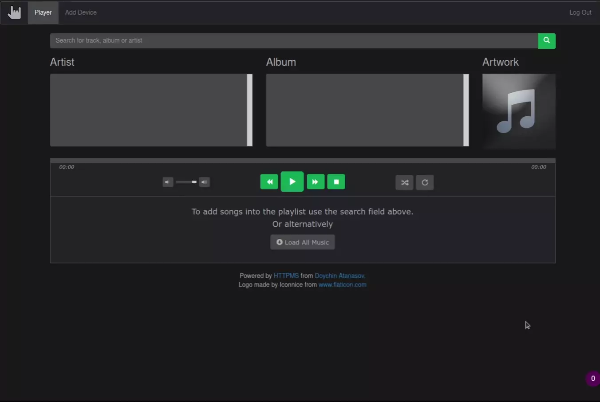

Euterpe
======


Euterpe is self-hosted streaming service for music. Formerly known as "HTTPMS (HTTP Media Server)".

A way to listen to your music library from everywhere. Once set up you won't need anything but a browser. Think of it as your own Spotify service over which you have full control. Euterpe will let you browse through and listen to your music over HTTP(s). Up until now I've had a really bad time listening to my music which is stored back home. I would create a mount over ftp, sshfs or something similar and point the local player to the mounted library. Every time it resulted in some upleasantries. Just imagine searching in a network mounted directory!

No more!

[](https://github.com/ironsmile/euterpe/actions/workflows/build-test-lint.yml?query=branch%3Amaster) [](https://godoc.org/github.com/ironsmile/euterpe) [](https://goreportcard.com/report/github.com/ironsmile/euterpe) [](https://coveralls.io/github/ironsmile/euterpe?branch=master)

* [Web UI](#web-ui)
* [Features](#features)
* [Demo](#demo)
* [Requirements](#requirements)
* [Install](#install)
* [Docker Image](#docker)
* [Configuration](#configuration)
* [As an API](#as-an-api)
* [OSX Media Keys Control](#media-keys-control-for-osx)
* [Clients](#clients)
* [Change Log](CHANGELOG.md)
* [Name Change](#name-change)


Web UI
======

Have a taste of how its web interface looks like



It comes with a custom [jPlayer](https://github.com/happyworm/jPlayer) which can handle playlists with thousands of songs. Which is [an imrovement](https://github.com/jplayer/jPlayer/pull/192) over the original which never included this performance patch.

I feel obliged to say that the music on the screenshot is written and performed by my close friend [Velislav Ivanov](http://www.progarchives.com/artist.asp?id=4264).


Features
======

* Simple. It is just one binary, that's it! You don't need to faff about with interpreters or web servers
* Fast. A typical response time on my more than a decade old mediocre computer is 26ms for a fairly large collection
* Supports the most common audio formats such as mp3, oga, ogg, wav, flac, opus, web and m4a audio formats
* Built-in fast and simple Web UI so that you can play your music on every device
* Media and UI could be served over HTTP(S) natively without the need for other software
* User authentication (HTTP Basic, query token, Bearer token)
* Media artwork from local files or automatically downloaded from the [Cover Art Archive](https://musicbrainz.org/doc/Cover_Art_Archive)
* Artist images could be downloaded automatically from [Discogs](https://www.discogs.com/)
* Search by track name, artist or album
* Download whole album in a zip file with one click
* Controllable via media keys in OSX with the help of [BeardedSpice](https://beardedspice.github.io/)
* Extensible via [stable API](#as-an-api)
* Multiple [clients and player plugins](#clients)
* Uses [jplayer](https://github.com/happyworm/jPlayer) to play your music on really old browsers

Demo
======

Just show, don't talk, will ya? I will! You may take the server a spin with the [live demo](https://listen-to-euterpe.eu/demo) if you would like to. Feel free to thank all the artists who made their music available for this!

Requirements
======
If you want to install it from source you will need:

* [Go](http://golang.org/) 1.21 or later [installed and properly configured](http://golang.org/doc/install).

* [taglib](https://taglib.org/) - Read the [install instructions](https://github.com/taglib/taglib/blob/master/INSTALL.md) or better yet the one inside your downloaded version. Most operating systems will have it in their package manager, though. Better use this one.

* [International Components for Unicode](http://site.icu-project.org/) - The Euterpe binary dynamically links to `libicu`. Your friendly Linux distribution probably already has a package. For other OSs one should [go here](http://site.icu-project.org/download).

Install
======

The safest route is installing [one of the releases](https://github.com/ironsmile/euterpe/releases).

#### Linux & macOS

If you have [one of the releases](https://github.com/ironsmile/euterpe/releases) (for example `euterpe_1.1.0_linux.tar.gz`) it includes an `install` script which would install Euterpe in `/usr/bin/euterpe`. You will have to uninstall any previously installed versions first. An `uninstall` script is provided as well.

#### Windows

Automatically creating a release version for Windows is in progress at the moment. For the time being check out the next section, "From Source". Pay attention to the [requirements](#requirements) section above. As of writing this the author hasn't been yet initiated in the secret art of building and installing libraries on Windows so you are on your own.

#### From Source (any OS)

If installing from source running `go install` in the project root directory will compile `euterpe` and move its binary in your `$GOPATH`. Releases from `v1.0.1` onward have their go dependencies vendored in.

So, to install the `master` branch, you can just run

```
go install github.com/ironsmile/euterpe
```

Or alternatively, if you want to produce a release version you will have to get the repository. Then in the root of the project run

```
make release
```

This will produce a binary `euterpe` which is ready for distribution. Check its version with

```
./euterpe -v
```

First Run
======

Once installed, you are ready to use your media server. After its initial run it will create a configuration file which you will have to edit to suit your needs.

1. Start it with ```euterpe```

2. [Edit the config.json](#configuration) and add your library paths to the "library" field. This is an *important* step. Without it, `euterpe` will not know where your media files are.


Docker
======

Alternatively to installing everything in your environment you can use the [Docker image](https://hub.docker.com/r/ironsmile/euterpe).

Start the server by running:

```sh
docker run -v "${HOME}/Music/:/root/Music" -p 8080:9996 -d ironsmile/euterpe:latest euterpe
```

Then point your browser to [https://localhost:8080](https://localhost:8080) and you will see the Euterpe web UI. The `-v` flag in the Docker command will mount your `$HOME/Music` directory to be discoverable by Euterpe.


### Building the Image Yourself

You can use the [Dockerfile](Dockerfile) in this repository to build the image yourself.

```docker build -t ironsmile/euterpe github.com/ironsmile/euterpe```

The `euterpe` binary there is placed in `/usr/local/bin/euterpe`.

Configuration
======

HTTPS configuration is saved in a JSON file, different for every user in the system. Its
location is as follows:

* Linux or BSD: ```$HOME/.euterpe/config.json```
* Windows: ```%APPDATA%\euterpe\config.json```

When started for the first time Euterpe will create one for you. Here is an example:

```js
{
    // Address and port on which Euterpe will listen. It is in the form hostname[:port]
    // For exact explanation see the Addr field in the Go's net.http.Server
    // Make sure the user running Euterpe have permission to bind on the specified
    // port number
    "listen": ":443",

    // true if you want to access Euterpe over HTTPS or false for plain HTTP.
    // If set to true the "ssl_certificate" field must be configured as well.
    "ssl": true,

    // Provides the paths to the certificate and key files. Must be full paths, not
    // relatives. If "ssl" is false this can be left out.
    "ssl_certificate": {
        "crt": "/full/path/to/certificate/file.crt",
        "key": "/full/path/to/key/file.key"
    },

    // true if you want the server to require HTTP basic authentication. Credentials
    // are set by the 'authentication' field below.
    "basic_authenticate": true,
    
    // User and password for the HTTP basic authentication.
    "authentication": {
        "user": "example",
        "password": "example"
    },

    // An array with all the directories which will be scanned for media. They must be
    // full paths and formatted according to your OS. So for example a Windows path
    // have to be something like "D:\Media\Music".
    // As expected Euterpe will need permission to read in the library folders.
    "libraries": [
        "/path/to/my/files",
        "/some/more/files/can/be/found/here"
    ],
    
    // Optional configuration on how to scan libraries. Note that this configuration
    // is applied to each library separately.
    "library_scan": {
        // Will wait this much time before actually starting to scan a library.
        // This might be useful when scanning is resource hungry operation and you
        // want to postpone it on start up.
        "initial_wait_duration": "1s",
        
        // With this option a "operation" is defined by this number of scanned files.
        "files_per_operation": 1500,

        // After each "operation", sleep this amount of time.
        "sleep_after_operation": "15ms"
    },

    // When true, Euterpe will search for images on the internet. This means album artwork
    // and artists images. Cover Art Archive is used for album artworks when none is
    // found locally. And Discogs for artist images. Anything found will be saved in
    // the Euterpe database and later used to prevent further calls to the archive.
    "download_artwork": true,

    // If download_artwork is true the server will try to find artist artwork in the
    // Discogs database. In order for this to work an authentication is required
    // with their API. This here must be a personal access token. In effect the server
    // will make requests on your behalf.
    //
    // See the API docs for more information:
    // https://www.discogs.com/developers/#page:authentication,header:authentication-discogs-auth-flow
    "discogs_auth_token": "some-personal-token",

    // If set to true, logs will include a line for every HTTP request handled by the
    // server.
    "access_log": false
}
```

List with all directives can be found in the [configration wiki](https://github.com/ironsmile/euterpe/wiki/configuration#wiki-json-directives).

As an API
======

You can use Euterpe as a REST API and write your own player. Or maybe a plugin for your favourite player which would use your Euterpe installation as a back-end.

### v1 Compatibility Promise

The API presented in this README is stable and will continue to be supported as long as version one of the service is around. And this should be very _long time_. I don't plan to make backward incompatible changes. Ever. It has survived in this form since 2013. So it should be good for at least double than this amount of time in the future.

This means that **clients written for Euterpe will continue to work**. I will never break them on purpose and if this happened it will be considered a bug to be fixed as soon as possible.

### Authentication

When your server is open you don't have to authenticate requests to the API. Installations protected by user name and password require you to authenticate requests when using the API. For this the following methods are supported:

* Bearer token in the `Authorization` HTTP header (as described in [RFC 6750](https://tools.ietf.org/html/rfc6750)):

```
Authorization: Bearer token
```

* Basic authentication ([RFC 2617](https://tools.ietf.org/html/rfc2617)) with your username and password:

```
Authorization: Basic base64(username:password)
```

Authentication tokens can be acquired using the `/v1/login/token/` endpoint described below. Using tokens is the preferred method since it does not expose your username and password in every request. Once acquired users must _register_ the tokens using the `/v1/register/token/` endpoint in order to "activate" them. Tokens which are not registered may or may not work. Tokens may have expiration date or they may not. Integration applications must provide a mechanism for token renewal.

### Endpoints

* [About](#about)
* [Search](#search)
* [Browse](#browse)
* [Play a Song](#play-a-song)
* [Download an Album](#download-an-album)
* [Album Artwork](#album-artwork)
    * [Get Artwork](#get-artwork)
    * [Upload Artwork](#upload-artwork)
    * [Remove Artwork](#remove-artwork)
* [Artist Image](#artist-image)
    * [Get Artist Image](#get-artist-image)
    * [Upload Artist Image](#upload-artist-image)
    * [Remove Artist Image](#remove-artist-image)
* [Playlists](#playlists)
    * [List Playlists](#list-playlists)
    * [Create Playlist](#create-playlist)
* [Token Request](#token-request)
* [Register Token](#register-token)

### About

Query information about the server.

```sh
GET /v1/about
```

The returned response includes the server version. Example response:

```js
{
    "server_version":"v1.5.4"
}
```

This information could be used by clients to know what APIs are supported by the
server.

### Search

One can do a search query at the following endpoint

```sh
GET /v1/search/?q={query}
```

which would return an JSON array with tracks. Every object in the JSON represents a single track which matches the `query`. Example:

```js
[
   {
      "id" : 18, // Unique identifier of the track. Used for playing it.
      "album" : "Battlefield Vietnam", // Name of the album in which this track is found.
      "title" : "Somebody to Love", // Name of the song.
      "track" : 10, // Position of this track in the album.
      "artist" : "Jefferson Airplane", // Name of the artist or band who have performed the song.
      "artist_id": 33, // The ID of the artist who have performed the track.
      "album_id" : 2, // ID of the album in which this track belongs.
      "format": "mp3", // File format of this track. mp3, flac, wav, etc...
      "duration": 180000, // Track duration in milliseconds.
      "plays": 3, // Number of times this track has been played.
      "last_played": 1714834066, // Unix timestamp (seconds) when the track was last played.
      "rating": 5, // User rating in the [1-5] range.
      "favourite": 1714834066, // Unix timestamp (seconds) when the track was added to favourites.
      "bitrate": 1536000, // Bits per second of this song.
      "size": 3303014, // Size of the track file in bytes.
      "year": 2004 // Year when this track has been included in the album.
   },
   {
      "album" : "Battlefield Vietnam",
      "artist" : "Jefferson Airplane",
      "track" : 14,
      "format": "flac",
      "title" : "White Rabbit",
      "album_id" : 2,
      "id" : 22,
      "artist_id": 33,
      "duration": 308000
   }
]
```

The most important thing here is the track ID at the `id` key. It can be used for playing this track. The other interesting thing is `album_id`. Tracks can be grouped in albums using this value. And the last field of particular interest is `track`. It is the position of this track in the album.

Note that the track duration is in milliseconds.

_Optional properties_: Some properties of tracks are optional and may be omitted in the response when they are not set. They may not be set because no user has performed an action which sets them or the value may not be set in the track file's metadata. E.g. playing a song for the fist time will set its `plays` property to 1. The list of optional properties is: `plays`, `favourite`, `last_played`, `rating`, `bitrate`, `size`, `year`.

### Browse

A way to browse through the whole collection is via the browse API call. It allows you to get its albums or artists in an ordered and paginated manner.

```sh
GET /v1/browse/[?by=artist|album|song][&per-page={number}][&page={number}][&order-by=id|name|random|frequency|recency][&order=desc|asc]
```

The returned JSON contains the data for the current page, the number of all pages for the current browse method and URLs of the next or previous pages.

```js
{
  "pages_count": 12,
  "next": "/v1/browse/?page=4&per-page=10",
  "previous": "/v1/browse/?page=2&per-page=10",
  "data": [ /* different data types are returned, determined by the `by` parameter */ ]
}
```

For the moment there are three possible values for the `by` parameter. Consequently there are two types of `data` that can be returned: "artist", "song" and "album" (which is the **default**).

**by=artist**

would result in value such as

```js
{
  "artist": "Jefferson Airplane",
  "artist_id": 73,
  "album_count": 3 // Number of albums from this artist in the library.
  "favourite": 1614834066, // Unix timestamp in seconds. When it was added to favourites.
  "rating": 5 // User rating in [1-5] range.
}
```

The following fields are optional and may not be set:

* `favourite`
* `rating`

Missing fields mean that the artist hasn't been given rating or added to favourites.

**by=album**

would result in value such as

```js
{
  "album": "Battlefield Vietnam"
  "artist": "Various Artists",
  "album_id": 2,
  "duration": 1953000, // In milliseconds.
  "track_count": 12, // Number of tracks (songs) which this album has.
  "plays": 2312, // Number of times a song from the album has been played.
  "favourite": 1614834066, // Unix timestamp in seconds. When it was added to favourites.
  "last_played": 1714834066, // Unix timestamp in seconds.
  "rating": 5, // User rating in [1-5] range.
  "year": 2004 // Four digit year of when this album has been released.
}
```

The following fields are optional and may not be set:

* `favourite`
* `last_played`
* `rating`

Missing fields mean that the album hasn't been given rating, added to favourites or
no tracks from it have ever been played.

**by=song**

would in a list of objects which are the same as the result from the `/v1/search` endpoint.

**Additional parameters**

_per-page_: controls how many items would be present in the `data` field for every particular page. The **default is 10**.

_page_: the generated data would be for this page. The **default is 1**.

_order-by_: controls how the results would be ordered. **Defaults to `name` for albums and artists and `id` for tracks**. The meaning for its possible values is as follows:

* `id` means the ordering would be done by the song, album or artist ID, depending on the `by` argument.
* `name` orders values by their name.
* `random` means that the list will be randomly ordered.
* `frequency` will order by the number of times tracks have been played. For album this is the number of times tracks in this album has been played. Only applicable when `by` is `album` or `song`.
* `recency` will order tracks or albums by when was the last time the song or the album was played. Only applicable when `by` is `album` or `song`.
* `year` will order tracks or albums by the year of their release. Only applicable when `by` is `album` or `song`.

_order_: controls if the order would ascending (with value `asc`) or descending (with value `desc`). **Defaults to `asc`**.


### Play a Song

```
GET /v1/file/{trackID}
```

This endpoint would return you the media file as is. A song's `trackID` can be found with the search API call.

### Download an Album

```
GET /v1/album/{albumID}
```

This endpoint would return you an archive which contains the songs of the whole album.


### Album Artwork

Euterpe supports album artwork. Here are all the methods for managing it through the API.

#### Get Artwork

```
GET /v1/album/{albumID}/artwork
```

Returns a bitmap image with artwork for this album if one is available. Searching for artwork works like this: the album's directory would be scanned for any images (png/jpeg/gif/tiff files) and if anyone of them looks like an artwork, it would be shown. If this fails, you can configure Euterpe to search in the [MusicBrainz Cover Art Archive](https://musicbrainz.org/doc/Cover_Art_Archive/). By default no external calls are made, see the 'download_artwork' configuration property.

By default the full size image will be served. One could request a thumbnail by appending the `?size=small` query.

#### Upload Artwork

```
PUT /v1/album/{albumID}/artwork
```

Can be used to upload artwork directly on the Euterpe server. This artwork will be stored in the server database and will not create any files in the library paths. The image should be sent in the body of the request in binary format without any transformations. Only images up to 5MB are accepted. Example:

```sh
curl -i -X PUT \
  --data-binary @/path/to/file.jpg \
  http://127.0.0.1:9996/v1/album/18/artwork
```

#### Remove Artwork

```
DELETE /v1/album/{albumID}/artwork
```

Will remove the artwork from the server database. Note, this will not touch any files on the file system. Thus it is futile to call it for artwork which was found on disk.

### Artist Image

Euterpe could build a database with artists' images. Which it could then be used throughout the interfaces. Here are all the methods for managing it through the API.

#### Get Artist Image

```
GET /v1/artist/{artistID}/image
```

Returns a bitmap image representing an artist if one is available. Searching for artwork works like this: if artist image is found in the database then it will be used. In case there is not and Euterpe is configured to download images from internet and has a Discogs access token then it will use the MusicBrainz and Discogs APIs in order to retrieve an image. By default no internet requests are made.

By default the full size image will be served. One could request a thumbnail by appending the `?size=small` query.

#### Upload Artist Image

```
PUT /v1/artist/{artistID}/image
```

Can be used to upload artist image directly on the Euterpe server. It will be stored in the server database and will not create any files in the library paths. The image should be sent in the body of the request in binary format without any transformations. Only images up to 5MB are accepted. Example:

```sh
curl -i -X PUT \
  --data-binary @/path/to/file.jpg \
  http://127.0.0.1:9996/v1/artist/23/image
```

#### Remove Artist Image

```
DELETE /v1/artist/{artistID}/image
```

Will remove the artist image the server database. Note, this will not touch any files on the file system.

### Playlists

Euterpe supports creating and using playlists. Below you will find all supported operations
with playlists.

#### List Playlists

```
GET /v1/playlists
```

Returns all playlists in a list. This list omits the playlist tracks and returns only the basic information about each playlist. Example response:

```js
{
  "playlists": [
    {
      "id": 1, // ID of the playlist which have to be used for operations with it.
      "name": "Quiet Evening", // Display name of the playlist.
      "description": "For one is tired of heavy metal!", // Optional longer description.
      "tracks_count": 3, // Number of track in this playlist.
      "duration": 488000, // Duration of the playlist in milliseconds.
      "created_at": 1728838802, // Unix timestamp for when the playlist was created.
      "updated_at": 1728838923 // Unix timestamp for when the playlist was last updated.
    },
    {
      "id": 2,
      "name": "Summer Hits",
      "tracks_count": 4,
      "duration": 435000,
      "created_at": 1731773035,
      "updated_at": 1731773035
    }
  ]
}
```

#### Create Playlist

```
POST /v1/playlists
{
    "name": "Quiet Evening",
    "add_tracks_by_id": [14, 18, 255, 99]
}
```

Creating a playlist is done with a `POST` request with a JSON body. The body is an object
with the following properties:

* `name` (_string_) - A short name of the playlist. Used for displaying it in lists.
* `add_tracks_by_id` (_list_ with integers) - An ordered list with track IDs which will be added in the playlist. IDs may repeat.

This API method returns the ID of the newly created playlist:

```js
{
    "created_playlsit_id": 2
}
```

### Token Request

```
POST /v1/login/token/
{
  "username": "your-username",
  "password": "your-password"
}
```

You have to send your username and password as a JSON in the body of the request as described above. Provided they are correct you will receive the following response:

```js
{
  "token": "new-authentication-token"
}
```

Before you can use this token for accessing the API you will have to register it with on "Register Token" endpoint.

### Register Token

```
POST /v1/register/token/
```

This endpoint registers the newly generated tokens with Euterpe. Only registered tokens will work. Requests at this endpoint must authenticate themselves using a previously generated token.

Media Keys Control For OSX
======

You can control your Euterpe web interface with the media keys the same way you can control any native media player. To achieve this a third-party program is required: [BearderSpice](https://beardedspice.github.io/). Sadly, Euterpe (HTTPMS) is [not included](https://github.com/beardedspice/beardedspice/pull/684) in the default web strategies bundled-in with the program. You will have to import the [strategy](https://github.com/beardedspice/beardedspice/tree/disco-strategy-web#writing-a-media-strategy) [file](tools/bearded-spice.js) included in this repo yourself.

How to do it:

1. Install BeardedSpice. Here's the [download link](https://beardedspice.github.io/#download)
2. Then go to BeardedSpice's Preferences -> General -> Media Controls -> Import
3. Select the [bearded-spice.js](tools/bearded-spice.js) strategy from this repo

Or with images:

BeardedSpice Preferences:


Select "Import" under Genral tab:


Select the [bearded-spice.js](tools/bearded-spice.js) file:


Then you are good to go. Smash those media buttons!


Clients
======

You are not restricted to using the web UI. The server has a RESTful API which can easily be used from other clients. I will try to keep a list with all of the known clients here:

* ~~[httpms-android](https://github.com/ironsmile/httpms-android) is a Android client for HTTPMS.~~ Long abandoned in favour of a React Native mobile client.
* [euterpe-mobile](https://github.com/ironsmile/euterpe-mobile) is an iOS/Android mobile client written with React Native.
* [euterpe-rhythmbox](https://github.com/ironsmile/euterpe-rhythmbox) is an Euterpe client plugin for Gnome's Rhythmbox.
* [euterpe-gtk](https://github.com/ironsmile/euterpe-gtk) is a GTK client for mobile or desktop.


Name Change
======

Euterpe was previously known as "HTTPMS" from "HTTP Media Server". This name is too generic, it proved to be very hard to remember and was all-around a bad choice. At the time I was mostly thinking about the function and not the presentation of the project. Since there are more people using it now it makes sense to improve this aspect as well.

"Euterpe" was chosen because of the obvious association with the muse of music. There are still places where internally the software refers to itself as "HTTPMS" but they will go away with time. Hopefully soon.
