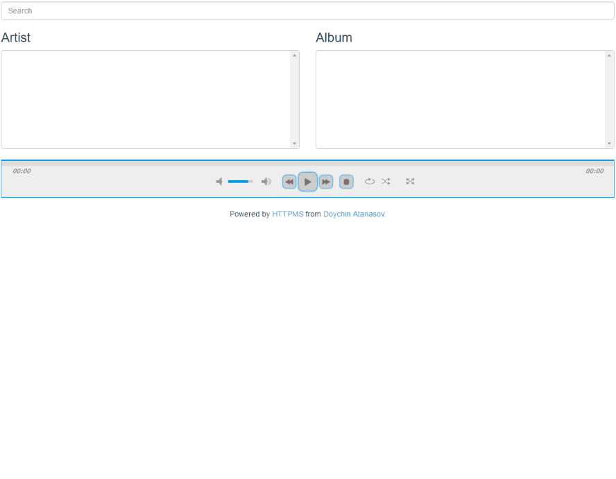
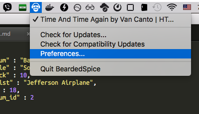
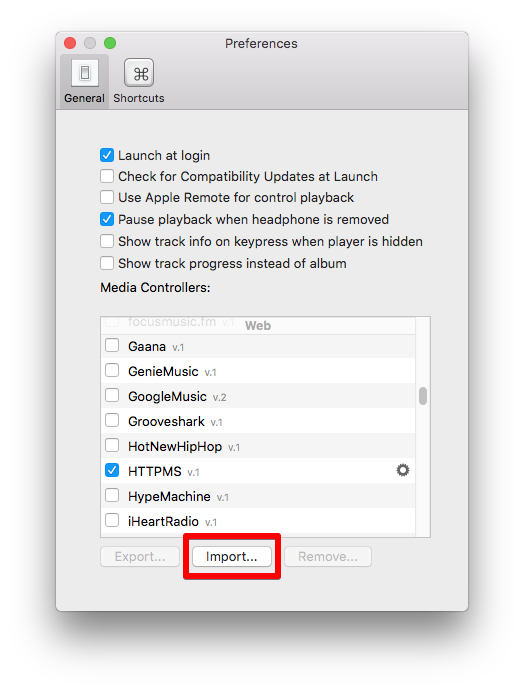
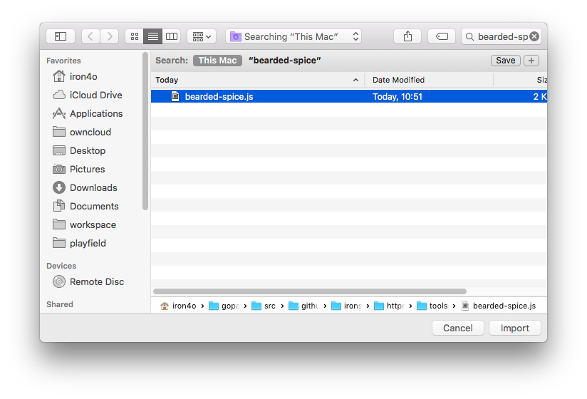

HTTP Media Server
======


A way to listen to your music library from everywhere. Once set up you won't need anything but a browser. Think of it as your own Spotify service over which you have full control. HTTPMS will let you browse through and listen to your music over HTTP(s). Up until now I've had a really bad time listening to my music which is stored back home. I would create a mount over ftp, sshfs or something similar and point the local player to the mounted library. Every time it resulted in some upleasantries. Just imagine searching in a network mounted directory!

No more!

[](https://travis-ci.org/ironsmile/httpms) [](https://godoc.org/github.com/ironsmile/httpms) [](https://goreportcard.com/report/github.com/ironsmile/httpms) [](https://coveralls.io/github/ironsmile/httpms?branch=master)

* [Web UI](#web-ui)
* [Features](#features)
* [Requirements](#requirements)
* [Install](#install)
* [Docker Image](#docker)
* [Configuration](#configuration)
* [As an API](#as-an-api)
* [OSX Media Keys Control](#media-keys-control-for-osx)
* [Clients](#clients)
* [Known Issues](#known-issues)
* [Change Log](CHANGELOG.md)


Web UI
======

Have a taste of how its web interface looks like



It comes with a custom [jPlayer](https://github.com/happyworm/jPlayer) which can handle playlists with thousands of songs. Which is [an imrovement](https://github.com/jplayer/jPlayer/pull/192) over the original which never included this performance patch.

I feel obliged to say that the music on the screenshot is written and performed by my close friend [Velislav Ivanov](http://www.progarchives.com/artist.asp?id=4264).


Features
======

* Uses [jplayer](https://github.com/happyworm/jPlayer) to play your music so it will probably work in every browser
* jplayer supports mp3, oga, wav, flac and m4a audio formats
* Interface and media via HTTPS
* HTTP Basic Authenticate
* Playlists
* Search by track name, artist or album
* Download whole album in a zip file with one click
* Controllable via media keys in OSX with the help of [BeardedSpice](https://beardedspice.github.io/)


Requirements
======
If you want to install it from source (from here) you will need:

* [Go](http://golang.org/) 1.5 or later [installed and properly configured](http://golang.org/doc/install).

* [go-taglib](https://github.com/landr0id/go-taglib) - Read the [install notes](https://github.com/landr0id/go-taglib#install)

* [go-sqlite3](https://github.com/mattn/go-sqlite3) - `go get github.com/mattn/go-sqlite3` would probably be enough.

For the moment I do not plan to distribute it any other way.


Install
======

The safest route is installing [one of the releases](https://github.com/ironsmile/httpms/releases).

If have an already built version (for example `https_1.1.0_linux.tar.gz`) it includes an `install` script which would install HTTPMS in `/usr/bin/httpms` and put all of its assets in `/etc/httpms`. You will have to uninstall any previously installed versions first. An `uninstall` script is provided as well.

If installing from source running `go install` in the project root directory will compile `httpms` and move its binary in your `$GOPATH`. Releases from `v1.0.1` onward have their go dependencies vendored in.

If you want to install the latest development version from the `master` branch, you can just run

```
go get github.com/ironsmile/httpms
```

First Run
======

Once installed, you are ready to use your media server. After its initial run it will create a configuration file which you will have to edit to suit your needs.

1. Start it with ```httpms```

2. [Edit the config.json](#configuration) and add your library paths to the "library" field. This is an *important* step. Without it, `httpms` will not know where your media files are.


Docker
======

Alternatively to installing everything in your environment you can use my [docker image](https://github.com/ironsmile/docker-httpms).

```docker build -t ironsmile/httpms github.com/ironsmile/docker-httpms```

It is ready for running or development.


Configuration
======

HTTPS configuration is saved in a json file, different for every user in the system. Its
location is as follows:

* Linux or BSD: ```$HOME/.httpms/config.json```
* Windows: ```%APPDATA%\httpms\config.json```

When started for the first time HTTPMS will create one for you. Here is an example:

```javascript
{
    // Address and port on which HTTPMS will listen. It is in the form hostname[:port]
    // For exact explanation see the Addr field in the Go's net.http.Server
    // Make sure the user running HTTPMS have permission to bind on the specified
    // port number
    "listen": ":443",

    // true if you want to access HTTPMS over HTTPS or false for plain HTTP.
    // If set to true the "ssl_certificate" field must be configured as well.
    "ssl": true,

    // Provides the paths to the certificate and key files. Must be full paths, not
    // relatives. If "ssl" is false this can be left out.
    "ssl_certificate": {
        "crt": "/full/path/to/certificate/file.crt",
        "key": "/full/path/to/key/file.key"
    },

    // true if you want the server to require HTTP basic authentication. Credentials
    // are set by the 'authentication' field below.
    "basic_authenticate": true,
    
    // User and password for the HTTP basic authentication.
    "authentication": {
        "user": "example",
        "password": "example"
    },

    // An array with all the directories which will be scanned for media. They must be
    // full paths and formatted according to your OS. So for example a Windows path
    // have to be something like "D:\Media\Music".
    // As expected HTTPMS will need permission to read in the library folders.
    "libraries": [
        "/path/to/my/files",
        "/some/more/files/can/be/found/here"
    ],
    
    // Optional configuration on how to scan libraries. Note that this configuration
    // is applied to each library separately.
    "library_scan": {
        // Will wait this mutch time before actually starting to scan a library.
        // This might be useful when scanning is resource hungry operation and you
        // want to postpone it on startup.
        "initial_wait_duration": "1s",
        
        // With this option a "operation" is defined by this number of scanned files.
        "files_per_operation": 1500,

        // After each "operation", sleep this amount of time.
        "sleep_after_operation": "15ms"
    }
}
```

List with all directives can be found in the [configration wiki](https://github.com/ironsmile/httpms/wiki/configuration#wiki-json-directives).

As an API
======

You can use HTTPMS as a REST API and write your own player. Or maybe a plugin for your favourite player which would use your HTTPMS installation as a backend.

Essentially, there are just a few API calls.

### Search

One can do a search query at the following endpoint

```sh
GET /search/?q={query}
```

wich would return an JSON array with tracks. Every object in the JSON represents a single track which matches the `query`. Example:

```js
[
   {
      "album" : "Battlefield Vietnam",
      "title" : "Somebody to Love",
      "track" : 10,
      "artist" : "Jefferson Airplane",
      "id" : 18,
      "album_id" : 2
   },
   {
      "album" : "Battlefield Vietnam",
      "artist" : "Jefferson Airplane",
      "track" : 14,
      "title" : "White Rabbit",
      "album_id" : 2,
      "id" : 22
   }
]
```

The most importat thing here is the track ID at the `id` key. It can be used for playing this track. The other interesting thing is `album_id`. Tracks can be grouped in albums using this value. And the last field of particular interest is `track`. It is the position of this track in the album.

### Browse

A way to browse through the whole collection is via the browse API call. It allows you to get its albums or artists in an ordered and paginated manner.

```sh
GET /browse/[?by=artist|album][&per-page={number}][&page={number}][&order-by=id|name][&order=desc|asc]
```

The returned JSON contains the data for the current page, the number of all pages for the current browse method and URLs of the next or previous pages.

```js
{
  "pages_count": 12,
  "next": "/browse/?page=4&per-page=10",
  "previous": "/browse/?page=2&per-page=10",
  "data": [ /* different data types are returned, determined by the `by` parmeter */ ]
}
```

For the moment there are two possible values for the `by` parameter. Consequently there are two types of `data` that can be returned: "artist" and "album" (which is the **default**).

**by=artist**

would resulst in value such as

```js
{
  "artist": "Jefferson Airplane",
  "artist_id": 73
}
```

**by=album**

would result in value such as

```js
{
  "album": "Battlefield Vietnam"
  "artist": "Jefferson Airplane",
  "album_id": 2
}
```

**Additional parameters**

_per-page_: controls how many items would be present in the `data` field for every particular page. The **default is 10**.

_page_: the generated data would be for this page. The **default is 1**.

_order-by_: controls how the resulst would be ordered. The value `id` means the ordering would be done by the album or artist ID, depending on the `by` argument. The same goes for the `name` value. **Defaults to `name`**.

_order_: controls if the order would ascending (with value `asc`) or descending (with value `desc`). **Defaults to `asc`**.


### Play a Song

```sh
GET /file/{trackID}
```

This endpoint would return you the media file as is. A song's `trackID` can be found with the search API call.

### Download an Album

```sh
GET /album/{albumID}
```

This endpoint would return you an archive which contains the songs of the whole album.


Media Keys Control For OSX
======

You can control your HTTPMS web interface with the media keys the same way you can control any native media player. To achieve this a third-party program is required: [BearderSpice](https://beardedspice.github.io/). Sadly, HTTPMS is [not included](https://github.com/beardedspice/beardedspice/pull/684) in the default web strategies bundled-in with the program. You will have to import the [strategy](https://github.com/beardedspice/beardedspice/tree/disco-strategy-web#writing-a-media-strategy) [file](tools/bearded-spice.js) included in this repo yourself.

How to do it:

1. Install BeardedSpice. Here's the [download link](https://beardedspice.github.io/#download)
2. Then go to BeardedSpice's Preferences -> General -> Media Controls -> Import
3. Select the [bearded-spice.js](tools/bearded-spice.js) strategy from this repo

Or with images:

BeardedSpice Preferences:



Select "Import" under Genral tab:



Select the [bearded-spice.js](tools/bearded-spice.js) file:



Then you are good to go. Smash those media buttons!


Clients
======

You are not restricted to using the web UI. The server has a RESTful API which can easily be used from other clients. I will try to keep a list with all of the known clients here:

* [httpms-android](https://github.com/ironsmile/httpms-android) is a Android client for HTTPMS
* [httpms-rhythmbox](https://github.com/ironsmile/httpms-rhythmbox) is HTTPMS client plugin for Gnome's Rhythmbox


Known Issues
======

* Non-ASCII searches are case sensitive.
